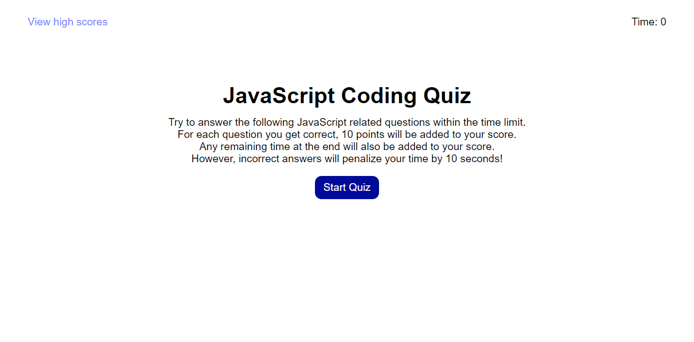

# JavaScript Code Quiz

## Description
This repository hosts the code for a 10 question JavaScript Code Quiz. Users have 90 seconds to answer the questions. Each correct answer adds 10 points to the user's score. Each incorrect answer deducts 10 seconds from the timer. Users also have the ability to save their high scores to local storage.

## Usage
The homepage can be viewed via Github pages using the following link: [JavaScript Code Quiz](https://djamz919.github.io/javascriptCodeQuiz/)

Users can navigate through the quiz and the high score board which stores high scores via local storage. After each round of the quiz, a user can add their initials and save their high score. The high score board can be cleared.

